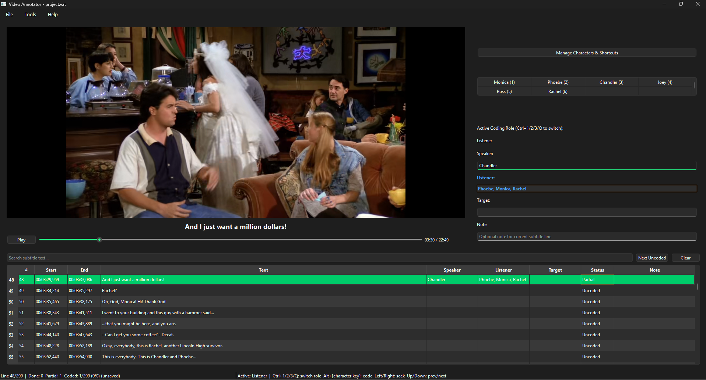

# CIGA Annotator

**CIGA Annotator** is a subtitle-centric video annotation tool with an Aegisub-like layout and keyboard-first coding workflow, designed for annotating character interactions (Speaker, Listener, Target). 

*This tool is part of the [CIGA (Character Interaction Graph Analysis)](https://github.com/MediaCompLab/ciga) project suite. The CSV exported from this annotator can be directly used in the CIGA library or [CIGA-GUI](https://github.com/MediaCompLab/ciga-gui).*

## Features

- **Aegisub-like layout:** Video + coding panel on top, clickable subtitle list at the bottom.
- **Split right panel:** Top area for character management, bottom area shows current Speaker/Listener/Target sets.
- **Three-way coding:** Code Speaker, Listener, and Target per subtitle line.
- **Keyboard-first workflow:**
   - `Space`: play/pause and continue line-by-line
   - `Up` / `Down`: previous / next subtitle line
   - `N`: jump to next uncoded subtitle line
   - `Left` / `Right`: rewind/forward 2 seconds
   - `Ctrl+F`: focus subtitle search box
   - `F1`: open shortcut help
   - `Ctrl+1 / 2 / 3`: set active coding role to Speaker / Listener / Target
   - `Ctrl+Q`: cycle active coding role
   - `Alt + key`: toggle character in active coding role
- **Dynamic character management:** Add/remove/edit character names and shortcut bindings during annotation.
- **Clickable subtitle list:** Click any row to jump to that line and restore its coding state.
- **Subtitle filtering:** Search subtitle text and optionally show only uncoded lines.
- **Status tracking:** Each subtitle row is marked as `Uncoded`, `Partial`, or `Done`.
- **Editable Note column:** Fill per-line notes either from right panel Note input or directly in the table.
- **Player controls:** Built-in play/pause button, timeline slider, and current/total time display.
- **Coding template options:** Optional inheritance of Listener/Target from the previous line.
- **Autosave + restore:** Periodic autosave with optional restore prompt on startup.
- **Unsaved-change protection:** Save/discard/cancel prompt when closing.
- **Safer writes:** Manual save and autosave use atomic write replacement to reduce data corruption risk.
- **CSV import/export:** Save and load annotation progress in UTF-8 BOM CSV.

**Screen shot**


## Installation

1. **Clone the Repository**  
   ```
   git clone https://github.com/MediaCompLab/ciga-annotator.git
   cd ciga/ciga-annotator
   ```

2. **Install Dependencies** 
   ```
   pip install -r requirements.txt
   ```

## Getting Started

1. **Run the Application** 
   ```
   python src/main.py
   ```

   If you are on Windows and get a Qt DLL load error in a Conda terminal, run with your system Python explicitly, for example:
   ```
   c:/python313/python.exe src/main.py
   ```

2. **Select Files**  
   Select your video and SRT files. Character file is optional.
   If provided, each line can be:
   - `CharacterName`
   - `CharacterName,ShortcutKey`

3. **Start Annotation**  
   Click "Start Annotation" to begin. The player auto-pauses at subtitle boundaries for coding.

4. **Manage Characters**
   Use the `Manage Characters & Shortcuts` button any time to edit names and bindings.

5. **Save Progress**
   - Manual save: `Ctrl+S`
   - Manual load: `Ctrl+O`
   - Autosave is performed periodically and can be restored automatically.

## Efficient Coding Workflow

1. Use `Up` / `Down` to move between subtitle lines.
2. Use `Ctrl+1/2/3` or `Ctrl+Q` to choose the active coding role.
3. Use `Alt + character key` to toggle characters into the active role.
4. Turn on `Only show uncoded` to focus on remaining lines.
5. Use `Inherit Listener/Target from previous line` to reduce repeated coding in dialogue runs.
6. Use `N` (or `Next Uncoded` button) to jump through remaining work quickly.

## Contributing

Contributions are welcome! To contribute:

1. **Fork the Repository**
2. **Create a New Branch**  
   Run: git checkout -b feature/YourFeatureName
3. **Make Your Changes**
4. **Commit Your Changes**  
   Run: git commit -m "Add Your Feature Description"
5. **Push to Your Fork**  
   Run: git push origin feature/YourFeatureName
6. **Create a Pull Request**

Please ensure your code follows the project's coding standards and includes appropriate documentation.

## License

This project is licensed under the GPL-3.0 License.

